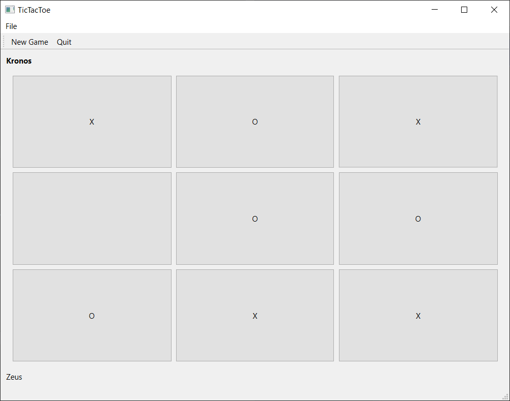
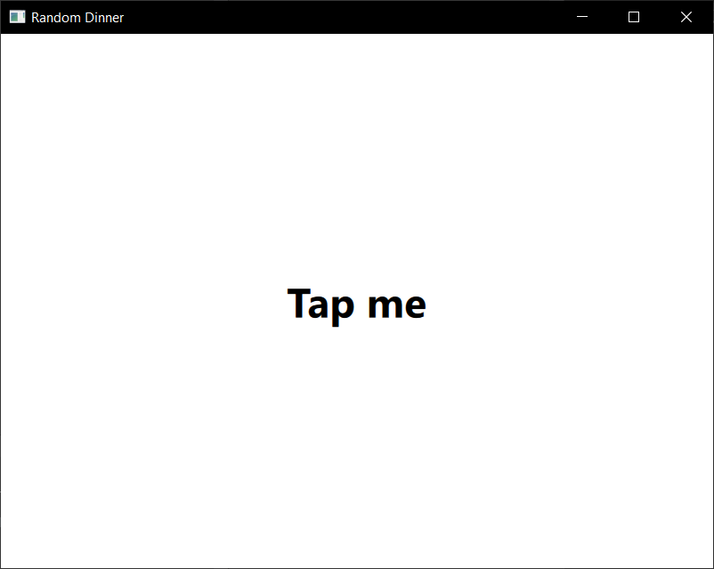

# Qt Practice

[C++](#C++) | [Qml](#Qml)

## C++ [... to top](#Qt-Practice)

### 1. Equation Calculator - [source code](https://github.com/kronosGR/QTpractice/tree/main/CPPWidgets-Calculator)

### 2. Simple ToDo - [source coude](https://github.com/kronosGR/QTpractice/tree/main/CPPWidgets-TODOlist)

### 3. Simple Clipboard Manager - [source code](https://github.com/kronosGR/QTpractice/tree/main/CPPWidgets-SimpleClipboard)

### 4. Simple StopWatch - [source code](https://github.com/kronosGR/QTpractice/tree/main/CPPWidgets-SimpleStopWatch)

### 5. TicTacToe (not completed) - [source code](https://github.com/kronosGR/QTpractice/tree/main/CPPWidgets-TicTacToe)

### 6. Simple TCP Chat Server - [source code](https://github.com/kronosGR/QTpractice/tree/main/CPPWidgets-TCPchatServer)

### 7. Simple TCP Chat Client - [source](https://github.com/kronosGR/QTpractice/tree/main/CPPWidgets-TCPchatClient)

### 8. Simple Screen Capture(image) - [source](https://github.com/kronosGR/QTpractice/tree/main/CPPWidgets-SimpleScreenCapture)

### 9. Simple Folder Browser - [source](https://github.com/kronosGR/QTpractice/tree/main/CPPWidgets-FolderBrowser)

### 10. Simple Todo - [source](https://github.com/kronosGR/QTpractice/tree/main/CPPWidgets-Todo)

### 10. Simple System Info - [source](https://github.com/kronosGR/QTpractice/tree/main/CPPwidgets-Sysinfo)

## Qml

[... to top](#Qt-Practice)

### 1. Simple Square meter calculator - [source code](https://github.com/kronosGR/QTpractice/tree/main/QMLsimpleSquareCalculator)

### 2. Simple Inches to Feet Converter - [source code](https://github.com/kronosGR/QTpractice/tree/main/QMLFeetInchesConverter)

### 3. Simple Dice Roller - [source code](https://github.com/kronosGR/QTpractice/tree/main/QMLDiceRoller)

### 4. Random Dinner Picker - [source code](https://github.com/kronosGR/QTpractice/tree/main/QMLRandomDinner)

### 5. Simple ImageViewer - [source code](https://github.com/kronosGR/QTpractice/tree/main/CPPQML-ImageViewer)

### 6. Simple Text Editor - [source code](https://github.com/kronosGR/QTpractice/tree/main/CPPQML-SimpleTextEditor)

